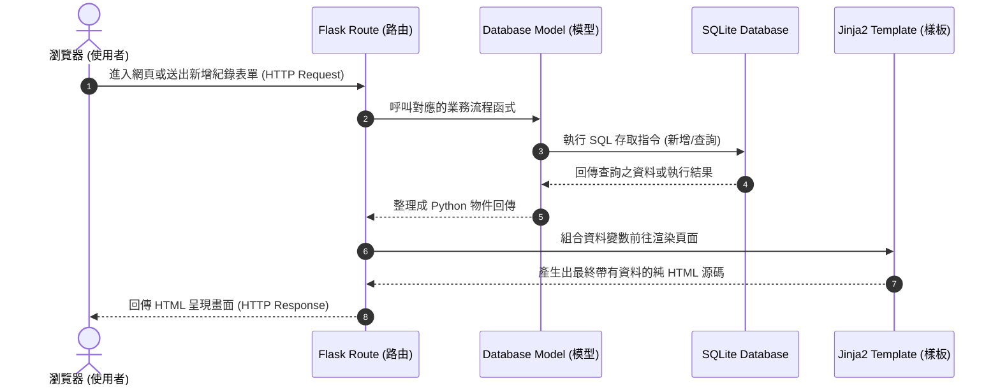

# 系統架構設計 (Architecture) - 個人記帳簿

本文件根據產品需求文件 (PRD)，規劃「個人記帳簿」系統的技術架構、資料夾結構與元件之間的職責分配，做為後續開發的藍圖。

## 1. 技術架構說明

本專案採用輕量且直覺的 Web 技術架構，不採用複雜的前後端分離設計，而是由後端伺服器直接渲染頁面，確保專案能快速建立與發布。

### 1.1 選用技術與原因
- **後端框架：Python + Flask**
  - **原因**：Flask 是一個輕量級的 Python Web 框架，學習曲線平滑，且具有高度的彈性。對於這類結構單純的記帳專案來說，不會有過度設計（over-engineering）的負擔。
- **模板引擎：Jinja2**
  - **原因**：身為 Flask 的預設樣板引擎，Jinja2 能讓我們在 HTML 檔案中寫入迴圈、條件判斷，並將後端計算好的餘額或收支清單直接動態渲染成網頁。
- **資料庫：SQLite**
  - **原因**：不需要額外架設資料庫伺服器，所有的資料都會儲存在一個本地端的檔案（例如 `database.db`）。對於個人記帳系統而言，已非常足夠且便於在不同電腦間轉移專案。
- **前端技術：HTML / CSS / JavaScript**
  - **原因**：利用原生網頁語言即可達成畫面設計與響應式開發要求，不需依賴 React 或 Vue 等複雜框架。

### 1.2 Flask MVC 模式說明
藉由借鏡軟體工程中的 MVC (Model-View-Controller) 模式，我們會以下列方式組織 Flask 專案：
- **Model (模型)**：負責定義收支紀錄的資料表結構，以及集中管理所有的資料庫互動操作（新增、查詢、修改、刪除）。
- **View (視圖)**：以 Jinja2 所管理的 HTML 樣板為主，僅負責負責「把資料顯示出來」以及處理使用者的表單互動介面。
- **Controller (控制器)**：在 Flask 中主要對應至**路由 (Routes)**，扮演仲裁者的角色。接收從瀏覽器傳來的請求，向 Model 調用資料，並將資料塞給 View 渲染結果。

## 2. 專案資料夾結構

良好的目錄結構可以確保專案的可讀性並方便分工。本專案建議結構如下：

```text
web_app_development/
├── app/                        # 應用程式的主要功能資料夾
│   ├── models/                 # 資料庫模型與操作
│   │   └── transaction.py      # 收支明細的資料表定義與資料查詢函式
│   ├── routes/                 # Flask 路由 (Controller)
│   │   └── main_routes.py      # 定義 URL 網址與對應處理邏輯 (如: /, /add, /stats)
│   ├── templates/              # Jinja2 HTML 模板 (View)
│   │   ├── base.html           # 全站共用的基礎網頁版型 (導覽列、頁尾)
│   │   ├── index.html          # 首頁 (顯示總結餘與收支列表)
│   │   └── add_record.html     # 新增或修改紀錄的表單頁面
│   └── static/                 # 靜態資源 (不需經過模板引擎渲染的檔案)
│       ├── css/
│       │   └── style.css       # 系統的自定義樣式
│       └── js/
│           └── main.js         # 前端警示或互動微動畫
├── instance/                   # 存放不進入版本控制的機密或運行時建立的檔案
│   └── database.db             # SQLite 資料庫實體檔案
├── docs/                       # 專案文件庫
│   ├── PRD.md                  # 產品需求文件
│   └── ARCHITECTURE.md         # 系統架構設計文件 (本文件)
├── app.py                      # 系統主要啟動入口 (載入路由與初始化設定)
└── requirements.txt            # Python 套件相依性清單
```

## 3. 元件關係圖

以下使用序列圖說明當使用者在記帳系統中操作時，各元件如何互相協作傳遞資料：



## 4. 關鍵設計決策

1. **應用程式工廠化 / 模組化設計**
   - **原因**：如果把所有路由、資料庫邏輯都塞進 `app.py` 中，很快就會讓檔案過於肥大難以維護。建立專門的 `models` 與 `routes` 目錄可以做到職責分離（Separation of Concerns）。
2. **採用 Jinja2 樣板繼承機制**
   - **原因**：讓所有網頁都繼承 `base.html`，可以一次性解決所有的導覽標籤跟載入共通 CSS/JS 問題。未來要修改頁面上方選單，只要修改一處即可。
3. **資料庫獨立放置於 `instance` 目錄**
   - **原因**：真實的資料庫檔案可能包含使用者的消費隱私，我們應該在 Git 的 `.gitignore` 裡面排除掉這類資料，所以建議設立 `instance` 專門放置本地資料。
4. **專屬的 Model 存取層**
   - **原因**：我們不在 Route 裡面直接執行原生的 `sqlite3.connect` 和 SQL Query，而是將資料庫存取寫在 `models/` 裡。這能讓路由維持簡潔，並讓所有的 SQL 指令可以集中在同一個檔案內受管理。
