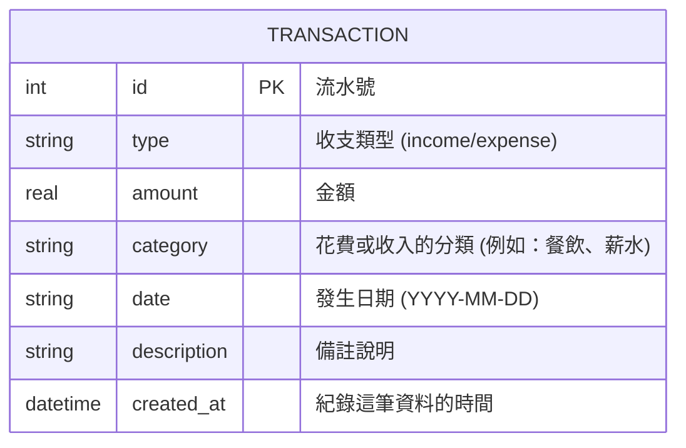

# 資料庫設計 (DB Design) - 個人記帳簿

本文件定義了「個人記帳簿」系統的資料庫 Schema 與資料模式（使用 SQLite 建立）。

## 1. ER 圖 (實體關係圖)

本系統採 MVP (Minimum Viable Product) 設計，為求快速上線且保有擴充性，收支明細與分類目前先集中記錄於 `TRANSACTION` 表單中。



*附註：未來如果「自訂並管理分類標籤」的功能擴展，會再分離出 `CATEGORY` 表單並定義一對多關係。*

## 2. 資料表詳細說明

### `transactions` (收支明細表)
用於儲存使用者的每一筆收入與支出資訊。

| 欄位名稱 | 型別 | 必填 | 預設值 | 說明 |
| --- | --- | --- | --- | --- |
| `id` | INTEGER | 是 | *(Auto Increment)* | Primary Key (主鍵流水號) |
| `type` | TEXT | 是 | - | 只能填寫 `income` (收入) 或是 `expense` (支出) |
| `amount` | REAL | 是 | - | 收支的金額 (使用浮點數方便未來擴充或運算) |
| `category` | TEXT | 是 | - | 紀錄這筆款項的分類 |
| `date` | TEXT | 是 | - | 交易之實際發生日，以 ISO 8601 `YYYY-MM-DD` 儲存方便排序 |
| `description` | TEXT | 否 | NULL | 使用者可以任意填寫額外備註 |
| `created_at` | DATETIME | 是 | `CURRENT_TIMESTAMP`| 系統自動產生的資料建立時間戳記 |

## 3. SQL 建表語法
定義在專案中的 `database/schema.sql` 檔案：
```sql
CREATE TABLE IF NOT EXISTS transactions (
    id INTEGER PRIMARY KEY AUTOINCREMENT,
    type TEXT NOT NULL CHECK(type IN ('income', 'expense')),
    amount REAL NOT NULL,
    category TEXT NOT NULL,
    date TEXT NOT NULL,
    description TEXT,
    created_at DATETIME DEFAULT CURRENT_TIMESTAMP
);
```

## 4. Python Model
資料表的 CRUD 操作介面已封裝在 `app/models/transaction.py` 的 `TransactionModel` 類別中，使用原生 `sqlite3` 提供下列功能：
- `create_table()`: 初始化執行 `schema.sql` 建立表單。
- `create(...)`: 新增紀錄。
- `get_all()`: 取得依日期排序的紀錄清單。
- `get_by_id(id)`: 取回單筆編輯用紀錄。
- `update(...)`: 更新紀錄。
- `delete(id)`: 刪除紀錄。
- `get_monthly_stats(year_month)`: 方便用於統計圖表或餘額計算的月份加總。
