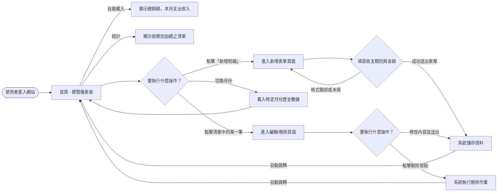
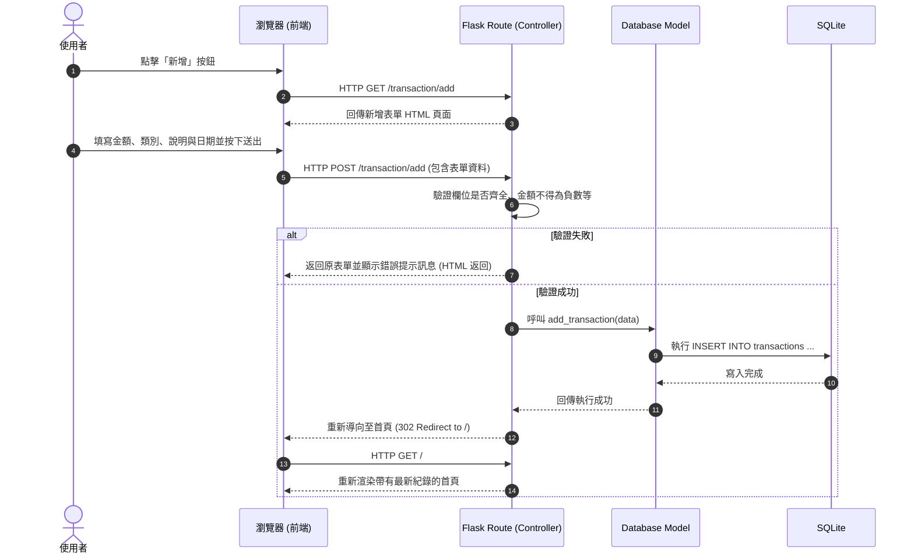

# 系統與使用者流程圖 (Flowchart) - 個人記帳簿

本文件延續 PRD 的功能需求與架構設計，將使用者的操作動線，以及系統內部的資料與狀態流動加以視覺化。

## 1. 使用者流程圖 (User Flow)

這張流程圖描述了當使用者進入「個人記帳簿」系統後，所能執行的各種主要操作路徑，涵蓋了明細的 CRUD (新增、讀取、修改、刪除) 與月度統計的切換。

## 2. 系統序列圖 (Sequence Diagram)

以下以「使用者填寫並送出新增一筆收支紀錄」的情境為例，說明資料在前端瀏覽器與後端元件之間如何流動與互動。

## 3. 功能清單對照表

根據 PRD 需求，以下整理出每個核心操作對應的網址路徑 (URL) 與 HTTP 傳遞方法。這可作為後續開始撰寫 Flask Route 與開發的一覽表。

| 功能名稱 | URL 路徑 | HTTP 方法 | 用途說明 |
| --- | --- | --- | --- |
| 首頁 (當月總覽) | `/` | GET | 渲染系統首頁，包含當下月份的結餘、統計與明細列 |
| 讀取新增表單 | `/transaction/add` | GET | 返回讓使用者填寫的新增明細表單頁面 |
| 送出新增資料 | `/transaction/add` | POST | 接收並驗證送來的新增資料，若成功則存入庫並跳回首頁 |
| 讀取編輯表單 | `/transaction/edit/<id>` | GET | 根據明細 ID 讀取該筆舊有資料，預填於表單畫面上 |
| 送出編輯資料 | `/transaction/edit/<id>` | POST | 更新特定的明細資料並存入資料庫 |
| 執行刪除作業 | `/transaction/delete/<id>` | POST | 刪除特定 ID 的收支資料。為了安全，建議不開放 GET 刪除 |
| 月份或時間切換 | `/stats/<year_month>` | GET | 將網址換成特定月份（例：`/stats/2026-04`），回傳該月的介面 |
